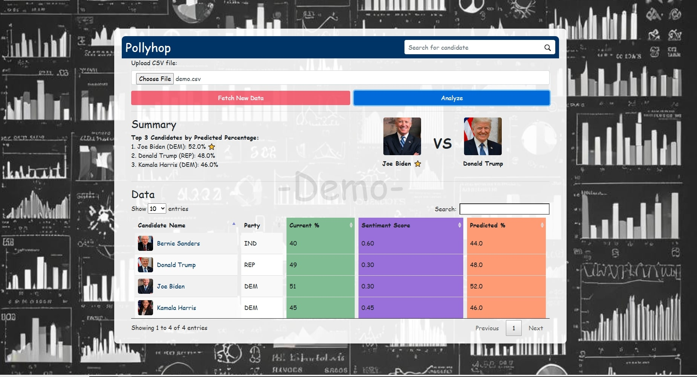

# Pollyhop - Demo

Welcome to the **Pollyhop - Demo** version! This demo showcases the core features of Pollyhop, an application that analyzes sentiment data from various sources and predicts candidate performance based on sentiment scores and polling data. Please note that this demo is limited in functionality and is provided for demonstration purposes only.

---

## Table of Contents

1. [Introduction](#introduction)
2. [Features](#features)
3. [Installation](#installation)
4. [Usage](#usage)
5. [Demo Limitations](#demo-limitations)
6. [Technologies Used](#technologies-used)
7. [Screenshots](#screenshots)
8. [License](#license)

---

## Introduction

Pollyhop is an application designed to predict political candidate performance by analyzing sentiment data from Bing News and Reddit, as well as historical polling data. The demo version of Pollyhop allows you to analyze a sample dataset and visualize the results through a user-friendly dashboard.

---

## Dashboard

<div align="center">
    
</div>

---

## Features

- Upload and analyze a sample CSV file.
- Visualize candidate sentiment and polling data.
- Display top-performing candidates based on predicted percentages.
- User-friendly and interactive dashboard with sorting and searching capabilities.
- Static data visualization for demonstration purposes.

---

## Installation

### Prerequisites

To run the demo, ensure you have the following installed:

- Python 3.x
- Flask
- Dependencies listed in the `requirements.txt` file

### Steps

1. Clone or download the repository.
2. Navigate to the project directory.
3. Install the necessary Python dependencies:
   ```bash
   pip install -r requirements.txt
