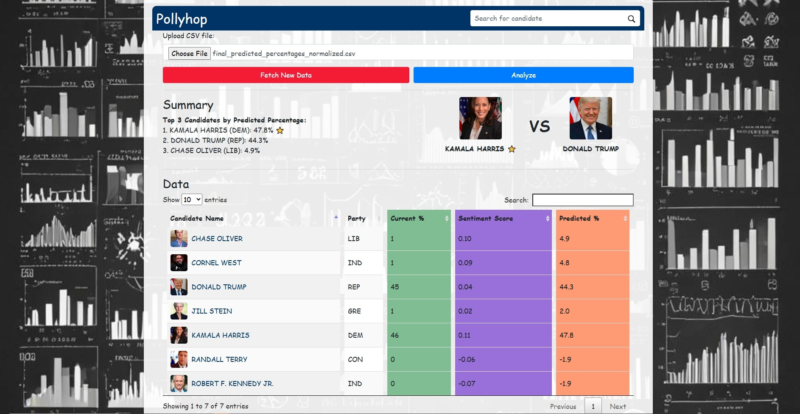
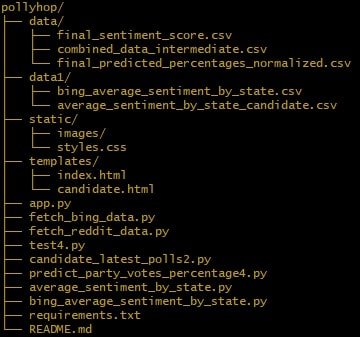

# Pollyhop Sentiment Analysis Tool

**Pollyhop** is a comprehensive sentiment analysis and polling tool that uses real-time data from Bing News and Reddit. It analyzes sentiment for political candidates across different states and combines this data with polling data to predict election outcomes. The tool includes features for data scraping, sentiment analysis, data visualization, and prediction.

## Table of Contents

- [Project Overview](#project-overview)
- [Features](#features)
- [Installation](#installation)
- [Usage](#usage)
- [Dependencies](#dependencies)
- [API Keys](#api-keys)
- [Project Structure](#project-structure)
- [Contributing](#contributing)
- [License](#license)

---

## Dashboard

<div align="left">
    
</div>

---

## Project Overview

The **Pollyhop Sentiment Analysis Tool** fetches news articles from Bing News and discussions from Reddit, performs sentiment analysis on them, and combines the sentiment scores with polling data to provide insights and predictions on political candidate performance by state. This tool supports decision-making by providing both historical and real-time sentiment analysis, as well as predictions based on combined data sources.

---

## Features

- **Data Scraping**: Scrapes data from Bing News and Reddit.
- **Sentiment Analysis**: Uses TextBlob for sentiment analysis on the scraped articles and posts.
- **Polling Data**: Integrates polling data to augment sentiment analysis and provide deeper insights.
- **Prediction Models**: Calculates predictions using weighted combinations of sentiment and polling data.
- **Data Visualization**: Provides tables and charts to visualize sentiment and predicted percentages for each candidate by state.
- **Interactive Dashboard**: Displays sentiment trends, prediction scores, and real-time polling data in a user-friendly dashboard.

---

## Installation

[Download the full Pollyhop app here](https://www.dropbox.com/scl/fi/3xg2bbq7js7twdia7ak5x/Pollyhop.zip?rlkey=i7hat9w6hbaj4tktd5uhknb9h&st=biyisjhl&dl=0)

To install and run the Pollyhop Sentiment Analysis Tool on another machine, follow these steps:

1. **Download and Unzip** the project:
   - Download the ZIP file containing the project files.
   - Unzip it to your desired directory.

2. **Install Python**: Ensure Python 3.x is installed on your machine. You can download it from [Python.org](https://www.python.org/downloads/).

3. **Create a Virtual Environment** (optional but recommended):
   ```bash
   python -m venv venv

4. **Activate the Virtual Environment: (On Windows)
   ```bash 
   .\venv\Scripts\activate

5. **Install Dependencies: 
   - Navigate to the project directory and run:
   ```bash
   pip install -r requirements.txt

6. **Run the Application: 
   - Once dependencies are installed, start the Flask server by running:
   ```bash
   python app.py

7. **Access the Web Application: Open your browser and navigate to http://127.0.0.1:5000/ to view the dashboard and start    using the tool.

---

## Usage

After completing the installation steps, you can run the `Pollyhop` project to perform sentiment analysis on political candidates and visualize the data.

### Running the Application

1. **Start the Flask Application**:
   Open your terminal or command prompt, navigate to the root directory of the `Pollyhop` project, and run the following command to start the Flask application:

   ```bash
   python app.py

2. **Access the Application: Once the server is running, open your browser and navigate to the following address:
http://127.0.0.1:5000/

3. **Upload CSV File for Analysis**:
   You can upload the "final_predicted_percentages_normalized" CSV file that can be found in the root directory of the app folder containing sentiment data for analysis through the web interface.  
   The CSV file should contain columns like `average_sentiment_1`, `average_sentiment_2`, and `predicted_pct`.

4. **Fetching New Data**:
   Click on the **"Fetch New Data"** button to trigger the Bing and Reddit API data fetching processes.  
   The progress bar will show real-time updates during the data fetching process.

5. **Data Analysis**:
   After fetching the new data or uploading a CSV, click on the analyze button, the application will analyze the data and calculate the combined average sentiment score and predictions.

6. **Viewing Results**:
   You can view the results in a user-friendly table on the main dashboard.  
   Sentiment data is visualized alongside other key metrics like predicted percentages.  
   The dashboard also supports sorting and searching for specific candidates.

7. **Interactive Candidate Information**:
   Click on a candidate's name to view detailed sentiment information and state-by-state sentiment analysis for that specific candidate.

---

## Data Flow

1. **Bing Data Collection**: Fetch news articles related to political candidates from Bing's News Search API.
2. **Reddit Data Collection**: Fetch Reddit posts related to political candidates and analyze their sentiment.
3. **Sentiment Analysis**: Perform sentiment analysis on the fetched data using TextBlob and combine it with historical polling data to predict voting percentages.
4. **Visualization**: Display the results in a dashboard with charts, tables, and other visual tools.

---

## Features

- **Sentiment Analysis**: Perform sentiment analysis on news articles and Reddit posts for political candidates.
- **Data Combination**: Merge sentiment data with historical polling data to predict voting outcomes.
- **User-Friendly Interface**: Upload custom CSV files or fetch new data through the web interface.
- **Visualization**: Real-time updates through a progress bar and interactive data visualizations.
- **State-by-State Sentiment Analysis**: Drill down into state-level sentiment analysis for each candidate.

---

## API Keys

This project requires API keys for accessing Bing News and Reddit data:

- **Bing News API Key**: Register for the Bing Search API on the Azure Portal.
- **Reddit API Key**: Create a Reddit app on the Reddit Developer Portal.

Once you have the keys, you can input them directly in the corresponding scripts (`fetch_bing_data.py` and `fetch_reddit_data.py`).

---

## Known Issues

- **API Quotas**: The Bing API has usage limits which may result in quota exceeded errors. You can manage your API keys or switch to a new key if the limit is reached.
- **Permission Errors**: When running the application, you might encounter file access issues due to operating system restrictions. Make sure that the application has sufficient permissions to read and write files.

---

## Project Structure

Below is the structure of the `Pollyhop` project. This structure includes the necessary files and directories to run the sentiment analysis tool.
<div align="left">
  
</div>


### Key Files and Directories

- **app.py**: The main entry point of the Flask application, handling routing and API calls.
- **test4.py**: The script responsible for processing and combining polling and sentiment data, and calculating final predicted percentages.
- **candidate_latest_polls2.py**: Script that fetches the latest political polling data for candidates.
- **predict_party_votes_percentage4.py**: Script that calculates historical vote percentages and applies resampling to predict future outcomes.
- **average_sentiment_by_state.py**: Performs sentiment analysis on state-based Reddit data.
- **bing_average_sentiment_by_state.py**: Analyzes sentiment from Bing News articles for each state.
- **requirements.txt**: Contains a list of Python packages that need to be installed for the project to run.
- **templates/**: Directory containing HTML files used to render the web pages in the Flask app.
- **data/**: Directory for storing intermediate and final processed data from the application.
- **data1/**: Directory containing datasets for state-based sentiment analysis from Bing and Reddit.

This structure should help you understand where each part of the application resides, making it easier to navigate and extend the project if needed.

---

## Contributing

1. Fork the repository.
2. Create a new branch: `git checkout -b feature-branch-name`.
3. Make your changes and commit them: `git commit -m 'Add some feature'`.
4. Push to the branch: `git push origin feature-branch-name`.
5. Open a pull request.

We appreciate your contributions and feedback!

---

## License

This project is licensed under the MIT License. See the LICENSE file for details.


